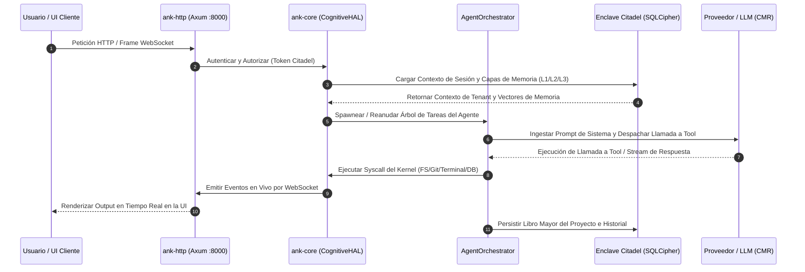

# Aegis OS

> **Un sistema operativo cognitivo.** Un binario. Sin dependencias de runtime. LLMs como ALUs bajo un motor de ejecución determinístico.

[](LICENSE)
[](https://github.com/Gustavo324234/Aegis-Core/actions)
[](Cargo.toml)
[](ARCHITECTURE.md)
[](https://github.com/sponsors/Gustavo324234)

---

## ¿Qué es Aegis?

Aegis es un sistema operativo cognitivo self-hosted — una plataforma donde los agentes de IA corren como procesos de primera clase, con memoria, scheduling, multi-tenancy y ejecución de herramientas integrados en el kernel.

El propósito fundamental de Aegis es ser el **asistente personal definitivo que gestiona un ecosistema de agentes especializados, actuando como el "CIO (Chief Information Officer) de la empresa de tu vida"**. Está diseñado para instalarse localmente en tu propia máquina o servidor, garantizando seguridad absoluta (local-first con datos cifrados por inquilino) para albergar toda tu información personal o corporativa, permitiendo que cualquier persona o empresa tenga su propio asistente autónomo e independiente.

No es un wrapper de chatbot. No es un pipeline de LangChain. Es un runtime a nivel de kernel para cargas de trabajo cognitivas autónomas.

---

## 🎬 Demostración del Sistema y Flujo de Ejecución

```
[ Prompt del Usuario ] ──> "Desarrollar y probar feature web para ticket CORE-280"
                                │
                                ▼
                       ┌─────────────────┐
                       │   Chat Maestro  │ (Proceso Supervisor Raíz)
                       └────────┬────────┘
                                │  (Spawnea Agente Especialista)
                                ▼
                    ┌───────────────────────┐
                    │ Especialista: Web Dev │ (Process ID: agent-8823)
                    └───────────┬───────────┘
                                │
      ┌─────────────────────────┼─────────────────────────┐
      ▼                         ▼                         ▼
 [ Filesystem ]            [ Terminal ]             [ Git Manager ]
 (Lectura/Escritura)       (Ejecuta `npm test`)     (Commit y Push)
      │                         │                         │
      └─────────────────────────┼─────────────────────────┘
                                │
                                ▼
                      ┌───────────────────┐
                      │ Árbol en Tiempo   │ (Telemetría en Vivo en Dashboard UI)
                      │ Real de Procesos  │
                      └───────────────────┘
```

**Ideas centrales:**

- **LLMs como ALUs** — los modelos de lenguaje son unidades de cómputo probabilísticas bajo un scheduler determinístico, no oráculos
- **Kernel Zero-Panic** — escrito en Rust con `clippy::unwrap_used` rechazado en CI
- **Protocolo Citadel** — autenticación multi-tenant Zero-Trust en cada capa
- **Un binario** — `ank-server` sirve la API HTTP, WebSocket y la UI React sin runtime externo
- **Listo para distro** — diseñado para correr como servicio de sistema, eventualmente embebido en una distribución Linux mínima
- **Aegis Connect** — túneles WebSocket seguros y persistentes que reemplazan los túneles Cloudflare Quick efímeros y aleatorios, vinculando tu instancia local directamente a una URL permanente y segura a través de tu cuenta de Orion ID

---

## Arquitectura

```
Browser / App Mobile
        │  HTTP + WebSocket
        ▼
 ank-server  (binario único Rust)
        │
        ├── ank-http    HTTP :8000  — API REST, WebSocket, UI React embebida
        ├── ank-core    Motor cognitivo — scheduler, VCM, agentes, DAG, plugins
        └── gRPC :50051 — comunicación interna, federación multi-nodo
```

### Bucle de Ejecución Cognitivo

El siguiente diagrama detalla cómo las interacciones de los clientes fluyen determinísticamente a través del gateway HTTP/WebSocket, el scheduler cognitivo (`ank-core`), el enclave cifrado de base de datos multi-tenant (Citadel SQLCipher) y los proveedores externos de inferencia LLM:



El sistema es multi-tenant: cada tenant tiene un entorno cognitivo aislado con sus propias capas de memoria (L1/L2/L3), árbol de agentes y almacenamiento cifrado (SQLCipher).

Ver [ARCHITECTURE.md](ARCHITECTURE.md) para detalle completo.

---

## Instalación Rápida

> [!IMPORTANT]
> **On-boarding Seguro e Higiene Criptográfica**:
> Los scripts `install.sh` y `install.ps1` verifican automáticamente las sumas criptográficas SHA256 de todos los binarios nativos y recursos comprimidos de la interfaz antes de su extracción.
> Si preferís inspeccionar y auditar los scripts antes de ejecutarlos (fuertemente recomendado para entornos seguros y de producción):
> 
> * **Linux/macOS:**
>   ```bash
>   curl -fsSL -o install.sh https://raw.githubusercontent.com/Gustavo324234/Aegis-Core/main/installer/install.sh
>   less install.sh # Inspeccioná el contenido del script
>   sudo bash install.sh
>   ```
> * **Windows (PowerShell como Administrador):**
>   ```powershell
>   Invoke-WebRequest -Uri https://raw.githubusercontent.com/Gustavo324234/Aegis-Core/main/installer/install.ps1 -OutFile install.ps1
>   Get-Content install.ps1 # Inspeccioná el contenido del script
>   PowerShell -ExecutionPolicy Bypass -File .\install.ps1
>   ```

Aegis distribuye binarios nativos pre-compilados para todas las plataformas principales. No se requiere compilación.

### Linux (Ubuntu 22.04+ / Debian 12+)

```bash
curl -fsSL https://raw.githubusercontent.com/Gustavo324234/Aegis-Core/main/installer/install.sh | sudo bash
```

El instalador te guía por:
1. **Modo de instalación** — Nativo (recomendado) o Docker
2. **Perfil de inferencia** — Cloud (API keys), Local (Ollama), o Híbrido
3. **Tier de hardware** — Laptop/VPS, Workstation, o servidor SRE-grade

Después de la instalación, Aegis arranca automáticamente e imprime tu URL de configuración:

```
################################################################
#          AEGIS OS — INSTALACIÓN COMPLETA                     #
################################################################

  Acceso Remoto (HTTPS): https://tu-tunel.trycloudflare.com
  URL Local:             http://192.168.1.x:8000?setup_token=...

  El token expira en 30 minutos.
  Para regenerar: sudo aegis token
################################################################
```

### macOS (Apple Silicon e Intel)

```bash
curl -fsSL https://raw.githubusercontent.com/Gustavo324234/Aegis-Core/main/installer/install.sh | sudo bash
```

El mismo `install.sh` detecta la plataforma y descarga el binario correcto (`macos-arm64` o `macos-x86_64`).

### Windows (x86_64)

Ejecutá PowerShell **como Administrador**:

```powershell
irm https://raw.githubusercontent.com/Gustavo324234/Aegis-Core/main/installer/install.ps1 | iex
```

Aegis se instala como un Servicio de Windows (`AegisOS`) y arranca automáticamente. El
instalador también agrega el CLI `aegis` al `PATH` (abrí una terminal nueva), así que los
mismos comandos del CLI de Linux funcionan — `aegis status`, `aegis logs`, `aegis diag`,
`aegis update`. Los comandos estándar de PowerShell también sirven:

```powershell
Start-Service AegisOS
Stop-Service AegisOS
Restart-Service AegisOS
Get-Service AegisOS
```

### Docker Compose (Despliegue Contenerizado en 1-Click)

Si preferís ejecutar Aegis en un contenedor aislado sin modificar dependencias ni paquetes del sistema operativo host:

```bash
curl -fsSL -o docker-compose.yml https://raw.githubusercontent.com/Gustavo324234/Aegis-Core/main/installer/docker-compose.yml
docker compose up -d
```

Aegis arrancará en `http://localhost:8000` con persistencia de datos aislada en el volumen `aegis_data`.

---

## Plataformas soportadas

Se publican binarios pre-compilados para cada commit a `main` (nightly) y cada release con tag:

| Plataforma | Arquitectura | Binario |
|---|---|---|
| Linux | x86_64 | `ank-server-linux-x86_64.tar.gz` |
| Linux | ARM64 | `ank-server-linux-arm64.tar.gz` |
| macOS | Apple Silicon (ARM64) | `ank-server-macos-arm64.zip` |
| macOS | Intel (x86_64) | `ank-server-macos-x86_64.zip` |
| Windows | x86_64 | `ank-server-windows-x86_64.zip` |

Todos los releases están disponibles en [github.com/Gustavo324234/Aegis-Core/releases](https://github.com/Gustavo324234/Aegis-Core/releases).

---

## Aegis CLI

Después de la instalación, el comando `aegis` está disponible en todo el sistema en **Linux/macOS y Windows**.

> **Windows:** el instalador despliega `aegis.ps1` más un wrapper `aegis.cmd` y los agrega al `PATH` del sistema (abrí una terminal nueva después de instalar). Los comandos de servicio de PowerShell siguen disponibles como alternativa — ver [docs/CLI_REFERENCE.md](docs/CLI_REFERENCE.md) para la tabla de equivalencias completa.

### Estado e información

```bash
aegis status          # Salud del servicio y conectividad API
aegis version         # Versión instalada
aegis logs            # Seguir logs en vivo (últimas 100 líneas)
aegis logs 200        # Seguir últimas 200 líneas
aegis diag            # Reporte diagnóstico SRE completo
```

### Control del servicio

```bash
aegis start           # Iniciar el servicio
aegis stop            # Detener el servicio
aegis restart         # Reiniciar el servicio
aegis token           # Imprimir URL de configuración con token fresco
aegis tunnel          # Iniciar manualmente el túnel Cloudflare
```

### Actualizaciones

```bash
aegis update           # Actualizar al último release estable (default)
aegis update --nightly # Actualizar al último build nightly de main
```

Ver [docs/CLI_REFERENCE.md](docs/CLI_REFERENCE.md) para referencia completa y equivalentes Windows.

---

## Compilar desde el código fuente

**Requisitos:** Rust 1.80+, Node.js 20+, `protoc`

```bash
git clone https://github.com/Gustavo324234/Aegis-Core.git
cd Aegis-Core

# Build completo: UI + binario embebido
make build-embed

# Ejecutar
./target/release/ank-server
```

---

## Estructura del Repositorio

```
aegis-core/
├── kernel/          Kernel Rust
│   ├── crates/      Arquitectura Rust modular:
│   │   ├── ank-server       Punto de entrada principal (Axum + gRPC)
│   │   ├── ank-core         Motor cognitivo — scheduler, VCM, agentes, DAG
│   │   ├── ank-http         Servidor HTTP/WebSocket (Axum) con UI React embebida
│   │   ├── ank-cli          CLI administrativa
│   │   ├── ank-mcp          Cliente Model Context Protocol
│   │   ├── aegis-supervisor Process manager basado en Rust
│   │   ├── aegis-sdk        SDK de plugins en Wasm
│   │   ├── aegis-connect-relay  Relay de Aegis Connect — túneles WebSocket persistentes
│   │   └── ank-proto        Contratos Protobuf y stubs de Rust generados
│   └── proto/       Contratos Protobuf (gRPC y protocolo de audio Siren)
├── shell/ui/        Interfaz web — React 18 / Vite / TypeScript / Tailwind
├── app/             Cliente mobile — React Native / Expo (modos Satélite y Cloud)
├── installer/       Deployment — install.sh, install.ps1, aegis CLI, servicio systemd
├── governance/      Tickets, epics activos, docs de arquitectura, codex
└── distro/          (futuro) distribución Linux
```

---

## Hitos Completados y Roadmap Activo

Creemos en la honestidad de ingeniería absoluta. El núcleo cognitivo, la arquitectura de binario único y el protocolo Citadel están completamente validados y listos para producción. Las extensiones de última generación (como la transmisión de voz WebRTC en tiempo real y el cliente móvil) se mantienen actualmente como capas de investigación y desarrollo experimentales activas para no comprometer la estabilidad del sistema.

| Epic / Componente Central | Descripción | Madurez / Estado |
|---|---|---|
| Epic 32 | Unificación — binario único Rust | `[Core / Estable]` ✅ Listo |
| Epic 42 | Realignment — auth, OAuth, router de modelos | `[Core / Estable]` ✅ Listo |
| Epic 43 | Orquestación Jerárquica Multi-Agente | `[Core / Estable]` ✅ Listo |
| Epic 44 | Developer Workspace (terminal, explorador de archivos, Git, PR manager) | `[Core / Estable]` ✅ Listo |
| Epic 45 | Arquitectura de Agentes Cognitivos | `[Core / Estable]` ✅ Listo |
| Epic 47 | Protocolo de Agente v2 (Paradigma Tool Use reemplaza parsing de texto) | `[Core / Estable]` ✅ Listo |
| Epic 48 | Observabilidad de Shell (Widgets del Dashboard en tiempo real y pestaña Sistema) | `[Core / Estable]` ✅ Listo |
| Epic 49 | Bucle Cognitivo (Loop ReAct multi-agente y capas de memoria semántica) | `[Core / Estable]` ✅ Listo |
| Epic 50 | Inbox de Agente (Intercambios directos Usuario-Supervisor en hilos) | `[Core / Estable]` ✅ Listo |
| Epic 51 | Inteligencia de Modelos (Ollama Cloud, scoring de contexto CMR v2) | `[Core / Estable]` ✅ Listo |
| Epic 53 | Estabilización (loop real de agentes LLM, panel de observabilidad, correcciones SRE) | `[Core / Estable]` ✅ Listo |
| Epic 54 | Aegis Connect (Túneles WebSocket persistentes mapeados a Orion ID) | `[Core / Estable]` ✅ Listo |
| CORE-150 | Scripting en Sandbox (Maker Capability - sandbox JS autónomo) | `[Core / Estable]` ✅ Listo |
| CORE-151 | Integración de contexto de proyecto (VCM y seguimiento de Git) | `[Core / Estable]` ✅ Listo |
| Epic 46 | Lanzamiento Público (docs, comunidad, salud open source) | `[Core / Activo]` 🚧 Pre-Lanzamiento |
| Epic 52 | Calidad de Voz (estabilización de stream Siren WebRTC y feedback de silenciar mic) | `[Experimental / I+D]` 🧪 I+D Activo |
| Epic 55 | App Móvil (modos Satélite y Cloud con integración Orion ID y Web) | `[Experimental / I+D]` 🧪 I+D Activo |

---

### Limitaciones Conocidas y Alcance de I+D

Para mantener una total honestidad de ingeniería, diferenciamos claramente entre el núcleo determinístico probado en batalla y las funcionalidades experimentales en fase de I+D:

* **Núcleo y Motor del Kernel (`ank-server`, `ank-core`, `ank-http`)**: Completamente estable, verificado mediante suites de pruebas unitarias/integración, con garantía de Zero-Panic en producción.
* **Protocolo de Voz Siren (`Epic 52`)**: El streaming de audio WebRTC en tiempo real es funcional pero se considera `[Experimental]`. La calidad del audio y la latencia dependen de los códecs del navegador del cliente y la disponibilidad del motor local STT/TTS.
* **Cliente Móvil (`Epic 55` / `app/`)**: La app en React Native Expo soporta autenticación mediante Orion ID y redirección web del workspace, pero la sincronización nativa en segundo plano se mantiene como `[Experimental]`.
* **Sandbox Maker Capability (`CORE-150`)**: La ejecución de scripts en sandbox opera en un entorno restringido, pero el soporte multihilo avanzado en plugins WASM es un módulo activo de I+D.

---

## Roadmap

- [ ] `distro/` — distribución mínima e inmutable de Linux autohospedada
- [ ] Optimización de rendimiento de Cognitive Loop y escalamiento de base de datos vectorial local (LanceDB L3)

---

## Contribuir

Aegis es open source y da la bienvenida a contribuciones.

Leé [CONTRIBUTING.md](CONTRIBUTING.md) para empezar. Se valoran contribuciones de código, documentación, traducciones y reportes de bugs.

El proyecto usa un flujo basado en tickets. Revisá [governance/TICKETS_MASTER.md](governance/TICKETS_MASTER.md) para trabajo abierto.

---

## Apoyar el Proyecto

Aegis es construido y mantenido por un solo desarrollador. Si te resulta útil, considerá apoyar su desarrollo:

- ⭐ **Dale una estrella** — ayuda con la visibilidad
- 🐛 **Reportá bugs** — abrí un issue
- 💬 **Difundilo** — compartilo con personas que construyen sistemas de IA
- ❤️ **Sponsoreá** — [github.com/sponsors/Gustavo324234](https://github.com/sponsors/Gustavo324234)

Los sponsoreos van directamente a la infraestructura de desarrollo: cómputo, costos de API y herramientas.

---

## Evidencia de Ruteo Cognitivo (PinchBench Benchmark)

Aegis OS no depende de mapeos de modelos estáticos ni cableados en el código. En un entorno de producción, las decisiones de enrutamiento son gobernadas en tiempo real por el planificador (scheduler) del kernel utilizando métricas empíricas reales de rendimiento.

Aegis obtiene evaluaciones en vivo de **PinchBench**, el leaderboard líder de la industria que mide las tasas de éxito (Success Rates), latencias y costos de ejecución de agentes de IA autónomos bajo entornos de uso de herramientas (Tool Use) de múltiples turnos y alta exigencia.

### Muestra de la Tabla del Líder de PinchBench (Real)

La siguiente tabla ilustra las métricas del mundo real que Aegis OS utiliza para construir su matriz de puntuación:

| ID del Modelo | Tasa de Éxito | Latencia Promedio | Costo (por 1M tokens de entrada) | Perfil de Tarea Óptimo |
|---|---|---|---|---|
| `anthropic/claude-opus-4.8-fast` | **94.49%** | ~159s | $15.00 | **Orquestación DAG / Edición de Código Crítico** |
| `google/gemini-3.1-flash-lite` | **80.50%** | ~15s | $0.075 | **Búsquedas de Memoria L1 / Chequeos de UI** |
| `openai/gpt-5.4-nano` | **77.26%** | ~12s | $0.05 | **Formateo de Texto / Extracción de Parámetros** |
| `openai/gpt-oss-120b` (Local) | **47.44%** | ~108s | Gratis (GPU Local) | **Respaldo Offline / Acciones de Alta Privacidad** |

### Cómo Planifica las Tareas Aegis (Ruteo Asimétrico)
Cuando un agente genera un árbol de tareas, el kernel analiza el bloque de ejecución y le asigna un `TaskType`:
1. **Tareas Sintácticas L1 (ej. extracción JSON, sanitización de prompts):** El scheduler las envía a modelos ultra-económicos como `gpt-5.4-nano` o `gemini-3.1-flash-lite`. Esto reduce los costos en un 99% con un impacto prácticamente nulo en el éxito de la tarea.
2. **Tareas de Razonamiento L2 (ej. modificaciones de código, auditorías de seguridad):** Se planifican en motores de razonamiento pesado como `claude-opus-4.8-fast` para garantizar la corrección y evitar fallos en tiempo de ejecución.
3. **Escudo de Privacidad Local-First:** Para enclaves de datos altamente sensibles, el planificador restringe el enrutamiento exclusivamente a hardware local (`gpt-oss-120b` o modelos Gemma/Llama locales), manteniendo soberanía absoluta sobre los datos.

Esta estrategia adaptativa garantiza una estabilidad operativa de grado SRE, reduciendo los costos totales de API hasta en un **80%** sin sacrificar las capacidades contextuales del asistente.

Para instrucciones completas de reproducibilidad y detalles de benchmarks, ver [docs/BENCHMARKS_PINCHBENCH.md](docs/BENCHMARKS_PINCHBENCH.md).

Para notas operativas del mundo real y experiencias de resiliencia SRE, ver [docs/DOGFOODING.md](docs/DOGFOODING.md).

---

## Filosofía

**Los LLMs son ALUs, no oráculos.** Un modelo de lenguaje es una unidad de cómputo probabilística que transforma tokens. La inteligencia del sistema viene de la capa determinística que orquesta esas transformaciones — el scheduler, la jerarquía de memoria, el árbol de agentes. El modelo es una herramienta, no la mente.

**Cognición a nivel de kernel.** Las cargas de trabajo de IA deberían manejarse igual que un SO maneja procesos: scheduling, aislamiento, límites de recursos, comunicación inter-proceso. No como una llamada de librería, sino como un servicio de kernel.

**Un binario.** La complejidad operacional es deuda técnica. Un sistema que corre como un único ejecutable, sin runtime Python, sin daemon Node, sin Docker requerido, es un sistema que puede mantenerse de verdad.

---

## Licencia

MIT — ver [LICENSE](LICENSE)

Copyright (c) 2026 Gustavo Aversente
