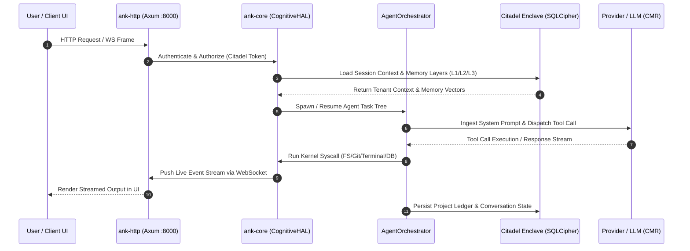

# Aegis OS

> **A cognitive operating system.** One binary. Zero runtime dependencies. LLMs as ALUs under a deterministic execution engine.

[](LICENSE)
[](https://github.com/Gustavo324234/Aegis-Core/actions)
[](Cargo.toml)
[](ARCHITECTURE.md)
[](https://github.com/sponsors/Gustavo324234)

---

## What is Aegis?

Aegis is a self-hosted cognitive operating system — a platform where AI agents run as first-class processes, with memory, scheduling, multi-tenancy, and tool execution built into the kernel.

The core mission of Aegis is to be the **ultimate personal assistant that manages a comprehensive ecosystem of specialized agents, acting as the "CIO (Chief Information Officer) of the company of your life."** It is built to be run locally or on a private server, ensuring absolute security (local-first with tenant-encrypted storage) so it can safely hold your personal or corporate data, allowing anyone—from individuals to entire organizations—to have their own private, autonomous assistant.

It is not a chatbot wrapper. It is not a LangChain pipeline. It is a kernel-level runtime for autonomous cognitive workloads.

---

## 🎬 System Showcase & Execution Flow

```
[ User Prompt ] ──> "Build & test web app feature for ticket CORE-280"
                        │
                        ▼
               ┌─────────────────┐
               │   Chat Maestro  │ (Root Supervisor Process)
               └────────┬────────┘
                        │  (Spawns Specialized Sub-Agent)
                        ▼
            ┌───────────────────────┐
            │ Specialist: Web Dev   │ (Process ID: agent-8823)
            └───────────┬───────────┘
                        │
      ┌─────────────────┼─────────────────┐
      ▼                 ▼                 ▼
 [ Filesystem ]    [ Terminal ]      [ Git Manager ]
 (Read/Write Code) (Run `npm test`)  (Commit & Push)
      │                 │                 │
      └─────────────────┼─────────────────┘
                        │
                        ▼
              ┌───────────────────┐
              │ Live Process Tree │ (Dashboard UI Real-time Telemetry)
              └───────────────────┘
```

**Core ideas:**

- **LLMs as ALUs** — language models are probabilistic compute units under a deterministic scheduler, not oracles
- **Zero-Panic kernel** — written in Rust with `clippy::unwrap_used` denied at CI level
- **Citadel Protocol** — Zero-Trust multi-tenant authentication at every layer
- **One binary** — `ank-server` serves the HTTP API, WebSocket streams, and the React UI with no external runtime
- **Distro-ready** — designed to run as a system service, eventually embedded in a minimal Linux distribution
- **Aegis Connect** — secure, persistent WebSocket tunnels replacing random/ephemeral Cloudflare Quick Tunnels, mapping your local instance directly to a permanent secure URL via your Orion ID account

---

## Architecture

```
Browser / Mobile App
        │  HTTP + WebSocket
        ▼
 ank-server  (single Rust binary)
        │
        ├── ank-http    HTTP :8000  — REST API, WebSocket, embedded React UI
        ├── ank-core    Cognitive engine — scheduler, VCM, agents, DAG, plugins
        └── gRPC :50051 — internal communication, multi-node federation
```

### Cognitive Execution Loop

The diagram below illustrates how client interactions flow deterministically through the HTTP/WebSocket gateway, the cognitive scheduler (`ank-core`), the multi-tenant encrypted database enclave (Citadel SQLCipher), and external LLM inference providers:



The system is multi-tenant: each tenant gets an isolated cognitive environment with its own memory layers (L1/L2/L3), agent tree, and encrypted data store (SQLCipher).

See [ARCHITECTURE.md](ARCHITECTURE.md) for full detail.

---

## Quick Install

> [!IMPORTANT]
> **Secure On-boarding & Cryptographic Hygiene**:
> The `install.sh` and `install.ps1` scripts automatically verify the cryptographic SHA256 checksums of all native binaries and compressed UI assets before extraction.
> If you prefer to inspect and audit the scripts before executing them (strongly recommended for production and secure environments):
> 
> * **Linux/macOS:**
>   ```bash
>   curl -fsSL -o install.sh https://raw.githubusercontent.com/Gustavo324234/Aegis-Core/main/installer/install.sh
>   less install.sh # Inspect script contents
>   sudo bash install.sh
>   ```
> * **Windows (PowerShell as Admin):**
>   ```powershell
>   Invoke-WebRequest -Uri https://raw.githubusercontent.com/Gustavo324234/Aegis-Core/main/installer/install.ps1 -OutFile install.ps1
>   Get-Content install.ps1 # Inspect script contents
>   PowerShell -ExecutionPolicy Bypass -File .\install.ps1
>   ```

Aegis ships pre-built native binaries for all major platforms. No compilation required.

### Linux (Ubuntu 22.04+ / Debian 12+)

```bash
curl -fsSL https://raw.githubusercontent.com/Gustavo324234/Aegis-Core/main/installer/install.sh | sudo bash
```

The installer guides you through:
1. **Installation mode** — Native (recommended) or Docker
2. **Inference profile** — Cloud (API keys), Local (Ollama), or Hybrid
3. **Hardware tier** — Laptop/VPS, Workstation, or SRE-grade server

After install, Aegis starts automatically and prints your setup URL:

```
################################################################
#          AEGIS OS — INSTALLATION COMPLETE                    #
################################################################

  Remote Access (HTTPS): https://your-tunnel.trycloudflare.com
  Local Setup URL:        http://192.168.1.x:8000?setup_token=...

  Token expires in 30 minutes.
  To regenerate: sudo aegis token
################################################################
```

### macOS (Apple Silicon & Intel)

```bash
curl -fsSL https://raw.githubusercontent.com/Gustavo324234/Aegis-Core/main/installer/install.sh | sudo bash
```

The same `install.sh` detects the platform and downloads the correct binary (`macos-arm64` or `macos-x86_64`).

### Windows (x86_64)

Run PowerShell **as Administrator**:

```powershell
irm https://raw.githubusercontent.com/Gustavo324234/Aegis-Core/main/installer/install.ps1 | iex
```

Aegis installs as a Windows Service (`AegisOS`) and starts automatically. The installer
also adds the `aegis` CLI to your `PATH` (open a new terminal), so the same commands from
the Linux CLI work — `aegis status`, `aegis logs`, `aegis diag`, `aegis update`. Standard
PowerShell service commands work too:

```powershell
Start-Service AegisOS
Stop-Service AegisOS
Restart-Service AegisOS
Get-Service AegisOS
```

### Docker Compose (1-Click Containerized Mode)

If you prefer running Aegis in an isolated container without installing host system packages:

```bash
curl -fsSL -o docker-compose.yml https://raw.githubusercontent.com/Gustavo324234/Aegis-Core/main/installer/docker-compose.yml
docker compose up -d
```

Aegis will spin up on `http://localhost:8000` with isolated data persistence in the `aegis_data` volume.

---

## Platform Support

Pre-built binaries are published for every commit to `main` (nightly) and every tagged release:

| Platform | Architecture | Binary |
|---|---|---|
| Linux | x86_64 | `ank-server-linux-x86_64.tar.gz` |
| Linux | ARM64 | `ank-server-linux-arm64.tar.gz` |
| macOS | Apple Silicon (ARM64) | `ank-server-macos-arm64.zip` |
| macOS | Intel (x86_64) | `ank-server-macos-x86_64.zip` |
| Windows | x86_64 | `ank-server-windows-x86_64.zip` |

All releases are available at [github.com/Gustavo324234/Aegis-Core/releases](https://github.com/Gustavo324234/Aegis-Core/releases).

---

## Aegis CLI

After installation, the `aegis` command is available system-wide on **Linux/macOS and Windows**.

> **Windows:** the installer deploys `aegis.ps1` plus an `aegis.cmd` wrapper and adds them to the system `PATH` (open a new terminal after installing). PowerShell service commands remain available as an alternative — see [docs/CLI_REFERENCE.md](docs/CLI_REFERENCE.md) for the full equivalents table.

### Status & Info

```bash
aegis status          # Service health and API connectivity
aegis version         # Installed version
aegis logs            # Follow live logs (last 100 lines)
aegis logs 200        # Follow last 200 lines
aegis diag            # Deep SRE diagnostic report
```

### Service Control

```bash
aegis start           # Start the service
aegis stop            # Stop the service
aegis restart         # Restart the service
aegis token           # Print setup URL with fresh token
aegis tunnel          # Manually start Cloudflare Tunnel
```

### Updates

```bash
aegis update           # Update to latest stable release (default)
aegis update --nightly # Update to latest nightly build from main
```

See [docs/CLI_REFERENCE.md](docs/CLI_REFERENCE.md) for full command reference and Windows equivalents.

---

## Build from Source

**Requirements:** Rust 1.80+, Node.js 20+, `protoc`

```bash
git clone https://github.com/Gustavo324234/Aegis-Core.git
cd Aegis-Core

# Full build: UI + embedded binary
make build-embed

# Run
./target/release/ank-server
```

Build options:

| Command | Output | Notes |
|---|---|---|
| `make build` | Binary + separate UI assets | Set `UI_DIST_PATH=shell/ui/dist` at runtime |
| `make build-embed` | Single self-contained binary | No external files needed |
| `./build.sh` | Same as `make build` | Shell script alternative |

---

## Repository Structure

```
aegis-core/
├── kernel/          Rust kernel
│   ├── crates/      Modular Rust architecture:
│   │   ├── ank-server       Main binary entrypoint (Axum + gRPC)
│   │   ├── ank-core         Cognitive engine — scheduler, VCM, agents, DAG
│   │   ├── ank-http         HTTP/WebSocket server (Axum) with embedded React UI
│   │   ├── ank-cli          Administrative CLI
│   │   ├── ank-mcp          Model Context Protocol client
│   │   ├── aegis-supervisor Rust-based process manager
│   │   ├── aegis-sdk        Wasm plugin SDK
│   │   ├── aegis-connect-relay  Aegis Connect relay — persistent WebSocket tunnels
│   │   └── ank-proto        Protobuf contracts & generated Rust code
│   └── proto/       Protobuf contracts (gRPC & Siren audio protocol)
├── shell/ui/        Web interface — React 18 / Vite / TypeScript / Tailwind
├── app/             Mobile client — React Native / Expo (Satellite and Cloud modes)
├── installer/       Deployment — install.sh, install.ps1, aegis CLI, systemd service
├── governance/      Tickets, active epics, architecture docs, codex
└── distro/          (future) Linux distribution
```

---

## Completed Milestones & Active Roadmap

We believe in absolute engineering honesty. The core cognitive kernel, single-binary architecture, and Citadel protocol are fully validated and production-ready. Cutting-edge extensions (like real-time WebRTC voice streaming and the mobile app client) are currently active, functional experimental R&D layers to prevent technical bloat.

| Epic / Core Component | Description | Maturity / Status |
|---|---|---|
| Epic 32 | Unification — single Rust binary | `[Core / Stable]` ✅ Done |
| Epic 42 | Realignment — auth, OAuth, model router | `[Core / Stable]` ✅ Done |
| Epic 43 | Hierarchical Multi-Agent Orchestration | `[Core / Stable]` ✅ Done |
| Epic 44 | Developer Workspace (terminal, file browser, Git, PR manager) | `[Core / Stable]` ✅ Done |
| Epic 45 | Cognitive Agent Architecture | `[Core / Stable]` ✅ Done |
| Epic 47 | Agent Protocol v2 (Tool Use paradigm replacing text parsing) | `[Core / Stable]` ✅ Done |
| Epic 48 | Shell Observability (Dashboard real-time widgets & service tab) | `[Core / Stable]` ✅ Done |
| Epic 49 | Cognitive Loop (Multi-agent ReAct loop & memory layers) | `[Core / Stable]` ✅ Done |
| Epic 50 | Agent Inbox (Direct User-Supervisor thread exchanges) | `[Core / Stable]` ✅ Done |
| Epic 51 | Model Intelligence (Ollama Cloud, CMR v2 context scoring) | `[Core / Stable]` ✅ Done |
| Epic 53 | Stabilization (Real LLM agent loop, observability dashboard, SRE fixes) | `[Core / Stable]` ✅ Done |
| Epic 54 | Aegis Connect (Persistent WebSocket tunneling mapped to Orion ID) | `[Core / Stable]` ✅ Done |
| CORE-150 | Sandbox scripting (Maker Capability - autonomous JS sandbox) | `[Core / Stable]` ✅ Done |
| CORE-151 | Project context integration (Git/VCM active context tracking) | `[Core / Stable]` ✅ Done |
| Epic 46 | Public Launch (docs, community, open source health) | `[Core / Active]` 🚧 Pre-Launch |
| Epic 52 | Voice Quality (Siren WebRTC stream stabilization & mic-mute feedback) | `[Experimental / R&D]` 🧪 Active R&D |
| Epic 55 | Mobile App (Satellite and Cloud modes with Orion ID & Web integration) | `[Experimental / R&D]` 🧪 Active R&D |

---

### Known Limitations & Active R&D Boundaries

To maintain engineering honesty, we clearly distinguish between our battle-tested deterministic core and experimental R&D features:

* **Core & Kernel Engine (`ank-server`, `ank-core`, `ank-http`)**: Fully stable, tested with unit/integration suites, and enforced Zero-Panic in production.
* **Siren Voice Protocol (`Epic 52`)**: Real-time WebRTC audio streaming is functional but considered `[Experimental]`. Audio quality and latency depend heavily on client browser WebSockets/WebRTC codecs and local STT/TTS engine availability.
* **Mobile Client (`Epic 55` / `app/`)**: The React Native Expo client supports Orion ID authentication and workspace web redirection, but native background sync remains `[Experimental]`.
* **Maker Capability (`CORE-150`)**: Script sandbox execution operates in a restricted environment, but advanced multi-threading within custom WASM plugins is an evolving R&D module.

---

## Roadmap

- [ ] `distro/` — minimal immutable self-hosted Linux distribution
- [ ] Cognitive Loop performance optimization and local vector database scaling (LanceDB L3)

---

## Contributing

Aegis is open source and welcomes contributions.

Read [CONTRIBUTING.md](CONTRIBUTING.md) to get started. All contributions — code, docs, translations, bug reports — are valued.

The project uses a ticket-driven workflow. Check [governance/TICKETS_MASTER.md](governance/TICKETS_MASTER.md) for open work.

---

## Supporting the Project

Aegis is built and maintained by a solo developer. If it's useful to you, consider supporting its development:

- ⭐ **Star the repo** — helps with visibility
- 🐛 **Report bugs** — open an issue
- 💬 **Spread the word** — share with people building AI systems
- ❤️ **Sponsor** — [github.com/sponsors/Gustavo324234](https://github.com/sponsors/Gustavo324234)

Sponsorships go directly toward development infrastructure: compute, API costs, and tooling.

---

## Cognitive Routing & PinchBench Evidence

Aegis OS does not rely on static hardcoded model mappings. In a production environment, routing decisions are governed in real-time by the kernel scheduler using empirical agent performance metrics. 

Aegis pulls live evaluations from **PinchBench** — the leading industry leaderboard that measures raw autonomous LLM agent success rates, latencies, and execution costs under stressful multi-turn tool use environments. 

### Live PinchBench Leaderboard Sample

The table below illustrates the real-world metrics used by Aegis OS to build its scoring matrix:

| Model ID | Success Rate | Average Latency | Cost (per 1M input tokens) | Optimal Task Profile |
|---|---|---|---|---|
| `anthropic/claude-opus-4.8-fast` | **94.49%** | ~159s | $15.00 | **DAG Orchestration / Critical Code Edits** |
| `google/gemini-3.1-flash-lite` | **80.50%** | ~15s | $0.075 | **L1 Memory Searches / UI Layout Checks** |
| `openai/gpt-5.4-nano` | **77.26%** | ~12s | $0.05 | **Text Formatting / Parameter Extraction** |
| `openai/gpt-oss-120b` (Local) | **47.44%** | ~108s | Free (Host GPU) | **Offline Fallback / High-Privacy Actions** |

### How Aegis Schedules Tasks (Asymmetric Routing)
When an agent spawns a task tree, the kernel parses the execution block and assigns it a `TaskType`:
1. **L1 Syntactic Tasks (e.g. JSON extraction, prompt sanitization):** The scheduler routes these to ultra-cheap models like `gpt-5.4-nano` or `gemini-3.1-flash-lite`. This cuts cost by 99% with a negligible impact on success rates.
2. **L2 Reasoning Tasks (e.g. code modifications, security audits):** Routed to heavy-weight reasoning engines like `claude-opus-4.8-fast` to guarantee correctness and avoid runtime failures.
3. **Local-First Privacy Guard:** For highly sensitive enclaves, the scheduler restricts routing entirely to local hardware (`gpt-oss-120b` or local Gemma/Llama models), maintaining absolute data sovereignty.

This adaptive strategy ensures SRE-grade operational stability, bringing down overall API costs by up to **80%** without sacrificing the agent's contextual capabilities.

For full reproducibility instructions and benchmarking details, see [docs/BENCHMARKS_PINCHBENCH.md](docs/BENCHMARKS_PINCHBENCH.md).

For real-world operational notes and SRE resilience experiences, see [docs/DOGFOODING.md](docs/DOGFOODING.md).

---

## Philosophy

Aegis is built on a few firm beliefs:

**LLMs are ALUs, not oracles.** A language model is a probabilistic compute unit that transforms tokens. The system's intelligence comes from the deterministic layer that orchestrates those transforms — the scheduler, the memory hierarchy, the agent tree. The model is a tool, not the mind.

**Kernel-level cognition.** AI workloads should be managed the same way an OS manages processes: scheduling, isolation, resource limits, inter-process communication. Not as a library call, as a kernel service.

**One binary.** Operational complexity is a form of technical debt. A system that runs as a single executable, with no Python runtime, no Node daemon, no Docker required, is a system that can actually be maintained.

---

## License

MIT — see [LICENSE](LICENSE)

Copyright (c) 2026 Gustavo Aversente
