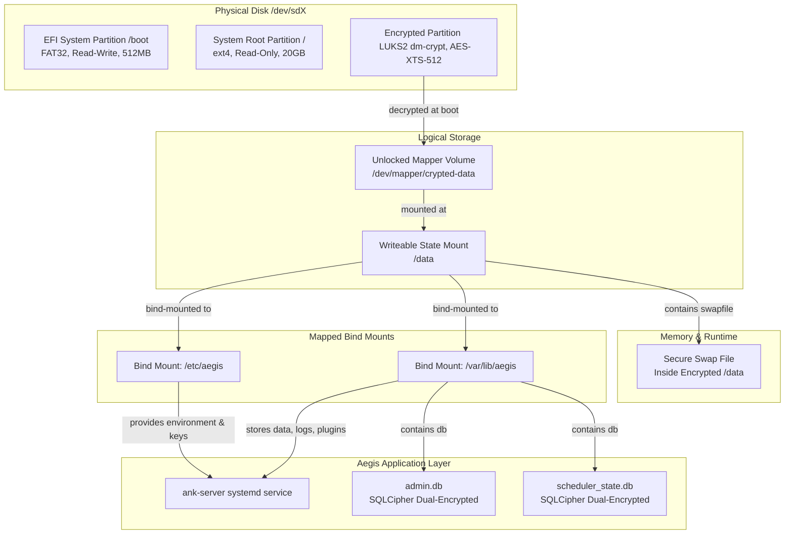

# Aegis Distro (Aegis OS Linux Base)

**Status: INITIATED & DESIGNED — Epic 32 Ready**

This directory contains the declarative architecture, NixOS system configuration files, and SRE deployment scripts to build and boot the minimal, immutable, and secure self-hosted **Aegis OS** Linux distribution.

## Core Architectural Vision

Aegis OS is built as a minimal, stateless, and immutable Linux operating system base with the **Aegis Cognitive Kernel (`ank-server`)** embedded at the root level as a first-class system service. By implementing a read-only system structure, we protect system files and binaries from runtime tampering, while isolating all persistent state databases, keys, plugins, and logs onto a separate writeable, cryptographically secured partition.



---

## Security Blueprint: Multi-Layered Citadel Principles

Aegis OS operates under strict **local-first** security principles to ensure that agent knowledge bases and system credentials never leak to raw storage or unauthorized third parties. This is achieved through a multi-layered cryptographic approach:

1. **Layer 1: Partition-Level LUKS Encryption**
   The `/data` partition is formatted with **LUKS2** using `aes-xts-plain64` with a 512-bit key size and `sha512` hashing. All persistent files—including SQLCipher keys, database binaries, plugins, and agent logs—remain fully encrypted at rest. Unlocking is prompted at early system boot via initrd.
2. **Layer 2: Database-Level SQLCipher Dual-Encryption**
   The core database files (`admin.db` and `scheduler_state.db`) are encrypted natively on-disk using **SQLCipher** (compiled statically into the `ank-server` Rust binary via `bundled-sqlcipher-vendored-openssl`). The encryption key is derived from the `AEGIS_ROOT_KEY`, generated securely on first-boot and stored strictly within the LUKS-encrypted envelope (`/etc/aegis/aegis.env`).
3. **Layer 3: Secure Swap to Prevent Leakage**
   To prevent runtime memory leaks or cold-boot extraction of raw keys, a 4GB swap space resides *inside* the encrypted volume (`/data/swapfile`) instead of a raw disk partition. If sensitive memory pages are swapped out, they remain encrypted at all times.
4. **Layer 4: Immutable System Root (`ro`)**
   The `/` root system is mounted as **read-only (`ro`)** with write journals completely disabled (`noload`). System libraries, the Linux kernel, NixOS systemd modules, and the `ank-server` system binary are tamper-proof. A malicious agent or compromised process cannot gain persistence by altering system files.

---

## File Structure

The `distro/` directory consists of the following initial declarative configuration files:

```
distro/
├── README.md               # This architecture and design documentation
├── nixos/
│   ├── flake.nix           # System declaration and dependency locking
│   ├── configuration.nix   # Declarative OS profile & packages
│   ├── hardware-configuration.nix # Immediacy-boot partitions, LUKS maps & swap config
│   ├── aegis-service.nix   # Custom systemd module mapping ank-server
│   └── ank-server.nix      # Nix package compilation derivation for Aegis core
└── scripts/
    ├── install.sh          # Bare-metal target disk partitioner and installer
    └── bootstrap-data.sh   # LUKS partition mounter, env writer & directory builder
```

---

## Core System Integration Details

### Declarative NixOS Boot Mapping
Aegis OS is built with **NixOS**, guaranteeing absolute reproducibility and immutability. The Nix store `/nix/store` houses the static code, and Nix flakes manage system configurations. 

Static assets like the web UI (`ui-dist`) are mapped directly to `/usr/share/aegis/ui` in the read-only store, while dynamic directories `/etc/aegis` and `/var/lib/aegis` are declaratively bound to `/data/etc/aegis` and `/data/var/lib/aegis` on system activation:
```nix
system.activationScripts.aegis-dirs.text = ''
  mkdir -p /data/etc/aegis
  mkdir -p /data/var/lib/aegis
  chown -R aegis:aegis /data/etc/aegis /data/var/lib/aegis
'';

fileSystems."/etc/aegis" = {
  device = "/data/etc/aegis";
  options = [ "bind" ];
};
```

### Immediate Service Boot Flow
On system startup:
1. `systemd-boot` loads the kernel and initial ramdisk (`initrd`).
2. `initrd` mounts the read-only `/` system.
3. The operator is prompted for the LUKS passphrase to map `/dev/disk/by-label/AEGIS_CRYPTDATA` to `/dev/mapper/crypted-data`.
4. System activation scripts run, mapping bind mounts from `/data` to `/etc/aegis` and `/var/lib/aegis`.
5. Systemd loads `/etc/aegis/aegis.env` environment variables.
6. The `aegis` service immediately boots the cognitive kernel (`ank-server`), serving the Web UI on `http://localhost:8000`.

---

## Build & Installation Guide

### Prerequisites
- Nix package manager installed on host system (for building), or a booted NixOS minimal installer.
- Target device matching `x86_64` or `arm64` architecture.

### Automatic Bare-Metal Installation
1. Boot into a minimal Linux/NixOS environment.
2. Download or clone this directory.
3. Execute the SRE installer as root:
   ```bash
   sudo bash distro/scripts/install.sh
   ```
4. Enter the target disk name (e.g. `sda` or `nvme0n1`).
5. Set your custom LUKS passphrase to secure the persistent storage.
6. Wait for compilation and Nix package boots to complete.
7. Reboot the system and unlock your secure Citadel container.

### Local Testing / Development
You can test the system compilation locally inside a Nix-enabled shell:
```bash
nix build .#ank-server
```
This compiles the standalone `ank-server` binary with statically embedded SQLCipher support directly from the local repository state.
