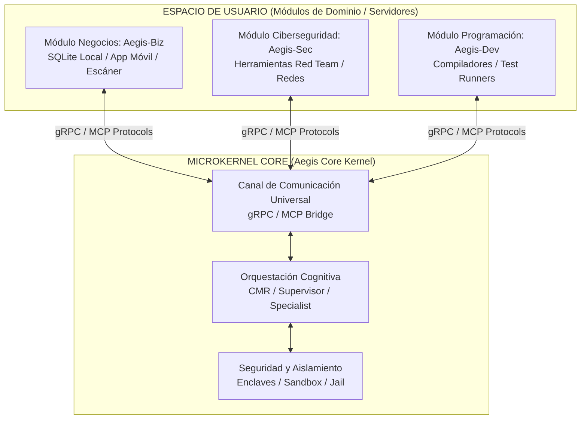

# Arquitectura de Microkernel y Módulos Autónomos de Aegis (Propuesta de Diseño)

Este documento define la visión y especificación arquitectónica para transformar a **Aegis OS** en un sistema operativo cognitivo basado en el paradigma de **Microkernel** con **Módulos Extensibles (Aegis Modules / Miniapps)**. 

La idea central es mantener un **Kernel Core** ultra-ligero y seguro que se dedique exclusivamente a tareas fundamentales, permitiendo instalar y desacoplar "Módulos de Dominio" (Negocios, Ciberseguridad, Programación, etc.) que cuenten con sus propias bases de datos, interfaces locales (móviles/computadoras) y herramientas específicas, pero integrados a nivel cognitivo y de datos mediante Aegis.

---

## 🏛️ 1. El Paradigma de Microkernel en Aegis

En los sistemas operativos tradicionales de microkernel (como L4 o QNX), el kernel solo maneja los servicios mínimos indispensables: manejo de memoria, hilos y comunicación entre procesos (IPC). Todos los demás servicios (sistemas de archivos, drivers de red, etc.) corren en el "espacio de usuario" como servidores independientes.

Llevando este concepto a un **Sistema Operativo Cognitivo (Aegis)**:



### A. El Microkernel Core (Aegis Kernel)
Se mantiene minimalista, seguro y rápido. Sus únicas responsabilidades son:
1.  **Seguridad y Aislamiento (Sandboxing):** Controlar los enclaves de datos de inquilinos (Tenant Enclaves), límites de recursos (timeouts, CPUs) y jail de sistemas de archivos.
2.  **Orquestación Cognitiva (Cognitive Routing):** El enrutamiento de tareas (CMR) y la gestión del ciclo de vida de los agentes (Chat Agent, Supervisors, Specialists).
3.  **Universal IPC Bridge:** Un canal de comunicación estandarizado para que los módulos se registren y expongan sus herramientas al kernel de forma segura.

### B. Los Módulos de Dominio (Domain Modules)
Son aplicaciones o servicios independientes y autocontenidos que se "instalan" en Aegis. Cada módulo:
*   Tiene su **propia base de datos aislada** (ej. SQLite / SQLCipher cifrada).
*   Tiene sus **propias herramientas especializadas** (ej. wrappers de escáneres, llamadas a APIs externas).
*   Tiene su **propia UI/Cliente independiente** (ej. una app móvil para lectura de códigos de barra o un dashboard web de inventario) que puede correr de forma local sin conexión directa a Aegis.
*   **Se integra a Aegis** registrándose a través de un manifiesto estándar.

---

## 📦 2. Casos de Uso Concretos

### Caso de Uso A: Módulo de Negocios (`Aegis-Biz`)
*   **Independencia:** Tienes una aplicación en tu celular que lee códigos de barras mediante la cámara para registrar ventas y stock de tu tienda de alimentos. Funciona de manera local y rápida con una base de datos SQLite en el dispositivo.
*   **Integración Cognitiva:** El módulo móvil se sincroniza periódicamente con el enclave cifrado de Aegis en tu servidor.
*   **Control por Lenguaje Natural:**
    *   Le dices a Aegis por chat: *"El proveedor de lácteos me trajo 10 quesos hoy a $500 c/u"*.
    *   Aegis Core intercepta el prompt, reconoce que la tarea pertenece al dominio de Negocios, y llama a la herramienta expuesta por `Aegis-Biz`: `update_inventory(product="queso", qty=10, cost=500, supplier="lácteos")`.
    *   Aegis actualiza el stock en la base de datos centralizada, calcula el balance del mes en tu libro contable (ledger), y la app de tu celular se sincroniza reflejando los 10 quesos nuevos inmediatamente.

### Caso de Uso B: Módulo de Ciberseguridad y Red Team (`Aegis-Sec`)
*   **Independencia:** Cuenta con herramientas y scripts especializados en pentesting (Nmap, Metasploit wrappers, rastreadores de vulnerabilidades).
*   **Integración Cognitiva:** Expone herramientas estructuradas a Aegis de forma aislada.
*   **Control Seguro:** Aegis permite lanzar comandos de auditoría ética únicamente bajo un entorno de Sandbox sumamente vigilado, previniendo que un agente tome decisiones destructivas sobre redes ajenas sin autorización explícita.

---

## 🔧 3. Arquitectura Técnica de Integración (¿Cómo interactúan?)

Para que un módulo sea "independiente pero integrable", la comunicación debe estar totalmente desacoplada. Utilizaremos el estándar de la industria **Model Context Protocol (MCP)** creado por Anthropic, combinado con interfaces **gRPC** de alto rendimiento.

### 1. El Manifiesto del Módulo (`module.json`)
Cada módulo se define mediante un archivo de configuración que le dice a Aegis qué herramientas aporta y cómo comunicarse:

```json
{
  "module_id": "aegis.domain.business",
  "display_name": "Aegis Business & Store Manager",
  "version": "1.0.0",
  "ipc_transport": {
    "protocol": "gRPC",
    "endpoint": "localhost:50071"
  },
  "database": {
    "driver": "sqlite",
    "encryption": true
  },
  "exposed_tools": [
    {
      "name": "biz_add_product",
      "description": "Register a new product in the store database",
      "parameters": {
        "type": "object",
        "properties": {
          "barcode": { "type": "string" },
          "name": { "type": "string" },
          "price": { "type": "number" }
        },
        "required": ["name", "price"]
      }
    },
    {
      "name": "biz_update_stock",
      "description": "Update the inventory stock count for a specific item",
      "parameters": {
        "type": "object",
        "properties": {
          "barcode": { "type": "string" },
          "name": { "type": "string" },
          "quantity_change": { "type": "integer" }
        },
        "required": ["quantity_change"]
      }
    }
  ]
}
```

### 2. Flujo de Descubrimiento y Ejecución Dinámica

```
[Usuario] ────> ( "Agrega 10 quesos al stock" )
                       │
                       ▼
               [Aegis Core Kernel] 
                       │
                       ├─(1) Revisa registro de módulos instalados (Aegis-Biz está activo)
                       ├─(2) Inyecta dinámicamente las 'exposed_tools' de Aegis-Biz al LLM
                       │
                       ▼
               [Modelo de Lenguaje (LLM)]
                       │
                       ├─(3) Razona y genera llamada a herramienta:
                       │     "biz_update_stock" { "name": "queso", "quantity_change": 10 }
                       │
                       ▼
               [Aegis Core Kernel]
                       │
                       ├─(4) Intercepta llamada de herramienta
                       ├─(5) La redirige vía gRPC/IPC al proceso autónomo de [Aegis-Biz]
                       │
                       ▼
                 [Módulo Aegis-Biz]
                       │
                       ├─(6) Modifica localmente su base de datos SQLite cifrada
                       ├─(7) Retorna confirmación JSON de éxito al Kernel
                       │
                       ▼
[Usuario] <──── ( "¡Listo! Se añadieron 10 quesos al inventario..." )
```

---

## 🗺️ 4. Roadmap de Implementación Sugerido

Para construir esta arquitectura paso a paso sin romper la estabilidad actual de Aegis-Core:

### Fase 1: Protocolo de Descubrimiento Dinámico de Módulos (En Desarrollo)
*   Crear una carpeta `kernel/modules/` en el repositorio.
*   Implementar un cargador en Rust que lea los manifiestos `module.json` al arrancar el servidor.
*   Modificar el `CognitiveRouter` para inyectar automáticamente los esquemas de herramientas de los módulos registrados al contexto del agente en base a su necesidad.

### Fase 2: Implementación del Bridge de Comunicación (IPC/gRPC)
*   Definir un canal proto de comunicación universal en `ank-proto` para el redireccionamiento de llamadas a herramientas desde el kernel hacia servicios externos.
*   Esto permitirá que el módulo de negocios corra en su propio proceso independiente (incluso escrito en otro lenguaje como Python, Go o Node.js) y se comunique de forma ultra-rápida a través de localhost con el kernel Rust.

### Fase 3: Sincronización y Réplica de Datos de Enclaves
*   Diseñar una API en Aegis Core que permita a aplicaciones móviles o de escritorio externas (como la app del celular) autenticarse de forma segura utilizando llaves criptográficas y realizar réplicas parciales del enclave del inquilino (Tenant DB) para trabajar sin conexión a Internet y sincronizarse al conectarse.

---

## 🎯 Conclusión
Esta visión transforma a Aegis de ser "un simple chatbot con herramientas" a convertirse en un verdadero **Ecosistema de Aplicaciones Inteligentes e Interconectadas (Aegis OS)**. Los usuarios no solo interactuarán con Aegis, sino que vivirán dentro de su ecosistema de miniaplicaciones modulares que resuelven problemas del mundo físico de forma descentralizada y segura.
